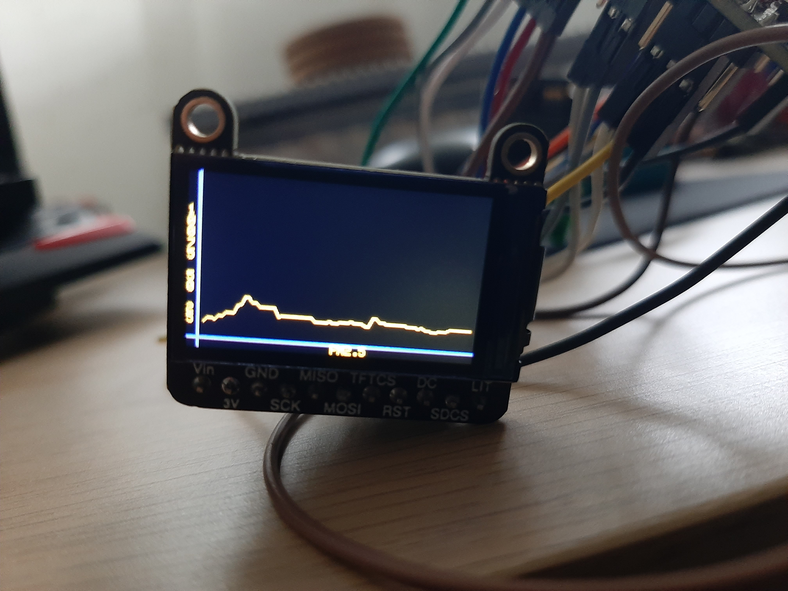

# AQMonitor

This repository represents the semestrial project I did in my 3rd year of university, an Air Quality Monitor that detects how good the air you breathe is, displays current values, plots data, and logs reading in local FileSystem.

## Motivation

I wanted to develop an air quality detection system because moving to Bucharest made me understood better the effect that pollution can have on every one of us, so I wanted a way in which to determine just how polluted the air aroung me was, after some research I came to the conclusion that I can determine that by mesuring Particlualte matter (dust, and other small particles) and CO2.

## List of components
- ESP32-C6-DevKit-1
    - Microcontroller that will act as the brain of the device.
- PMS5003
    - Sensor that can detect particles (ex PM2.5, meaning particles smaller than 2.5 microns).
- SCD-40
    - Sensor that can detect the CO2 level, temperature and humidity.
- 1.14'' 240x135 TFT Display
    - Small screen on which to display various data and plots.
- a button 

*[Documentation for all of them](https://github.com/GeorgePopescu318/AQMonitor/tree/main/doc)*

## How does it work?

 The device functionality is spread into 3 categories:

- Sensors:
    - For the two sensors I used libraries from *[Adafruit](https://www.adafruit.com/)* for easier implementation, it worked great, no problems with them.
    - The PMS5003 communicates with the ESP32 via UART.
    - The SCD-40 communicates via I2C.
- File system:
    - In order to store all the data from the sensors I used a local file system present on the ESP32 named *[LittleFS](https://randomnerdtutorials.com/esp32-write-data-littlefs-arduino/)*, the naming convension for this project was NN.CSV, each file would contain a header that describes each column. 
    - A new file could be created or there exits the option of appending data to the last created file.
- Screen:
    - The screen is able to display the current values of the reading and cycle through them by short pressing a button.
    - Drawing plots of each of the mesurements is also possible by long pressing the button, the display can show 75 values at a time in the plot.

Additioanlly you can change the sampling rate of the sensor readings as well as the interval in which the display will update.

## Preview 
Bellow you can see how the PM2.5 plot is represented. 
  